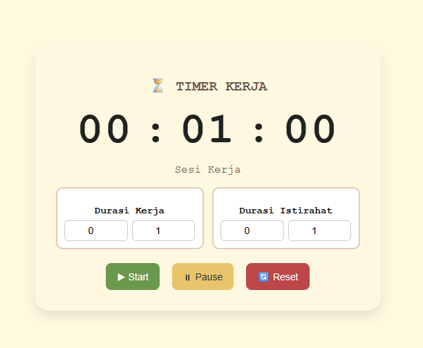
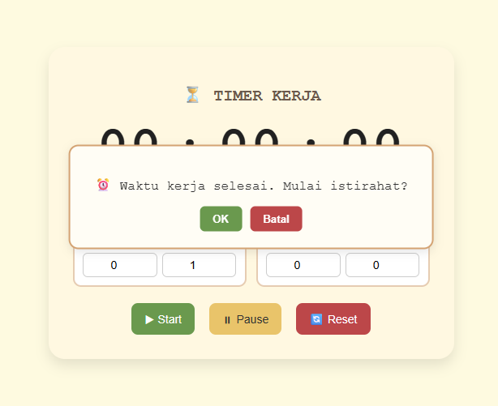

⏳ Timer Kerja
Aplikasi Timer Kerja berbasis Vanilla JavaScript untuk membantu pengguna mengatur waktu kerja dan istirahat secara terstruktur. Mengadopsi pola sederhana ala Pomodoro: periode fokus diikuti istirahat singkat. Memiliki UI responsif, popup konfirmasi, dan alarm audio.

Dibuat sebagai bagian dari Capstone Project (Simple Application) — IBM x Hacktiv8 Seminar.

📋 Daftar Isi
Deskripsi

Fitur Utama

Tampilan

Teknologi yang Digunakan

Struktur Folder Proyek

Cara Menjalankan Aplikasi Lokal

Dukungan AI (IBM Granite)

Demo Online

Lisensi

Kontak

🎯 Deskripsi
Timer Kerja dirancang untuk membantu pengguna:

Mengatur sesi kerja dan istirahat (jam + menit).

Meningkatkan fokus dan produktivitas melalui manajemen waktu sederhana.

Berpindah sesi dengan nyaman melalui popup konfirmasi.

Aplikasi berjalan sepenuhnya di browser (tanpa backend atau framework).

🚀 Fitur Utama
⏱ Atur durasi kerja & istirahat (jam + menit)

▶ Mulai, ⏸ Jeda, 🔄 Reset

🔔 Alarm suara saat sesi selesai

💬 Popup konfirmasi tengah layar sebelum lanjut sesi berikutnya

🔁 Alur otomatis: Kerja → Istirahat → Kerja

📱 Responsif (desktop & mobile)

🗃 Murni Vanilla JavaScript (tanpa server)

🖼 Tampilan Antar Muka

Tampilan Utama

Popup Konfirmasi

Alarm
Alarm audio otomatis berbunyi ketika sesi berakhir. File suara dapat diganti.

🛠 Teknologi yang Digunakan
Lapisan	Teknologi	Keterangan
UI	HTML5, CSS3	Struktur & gaya antarmuka
Logic	Vanilla JavaScript	Logika timer, popup, alarm
Hosting	Netlify	Deployment static site

📂 Struktur Folder Proyek
text
Salin
Edit
timer-kerja/
├─ index.html              # Struktur halaman
├─ style.css               # Styling UI
├─ script.js               # Logika timer + popup
├─ spongebob-fail.mp3      # File alarm default
├─ docs/
│  └─ images/
│     ├─ main-timer.png    # Screenshot tampilan utama
│     └─ popup.png         # Screenshot popup konfirmasi
└─ README.md               # Dokumentasi proyek

💻 Cara Menjalankan Aplikasi Lokal
Karena proyek ini murni Vanilla JS, cara jalankannya sangat sederhana:

Download atau clone repo:

bash
Salin
Edit
git clone https://github.com/NaufalG4/timer-kerja.git
cd timer-kerja
Buka file index.html:

Klik dua kali index.html, atau

Drag & drop ke browser (Chrome/Edge/Firefox)

Tidak perlu install Node.js, server lokal, atau build tools.

🧠 Dukungan AI (IBM Granite)
Proyek ini mengikuti arahan capstone:

"Buatlah sebuah situs web atau aplikasi dengan bantuan AI (IBM Granite) untuk mempercepat, meningkatkan, dan mendokumentasikan proses pengembangan kode."

Dalam proyek ini, IBM Granite digunakan sebagai asisten untuk:

🚀 Mempercepat perancangan struktur kode.

🧠 Meningkatkan kualitas logika timer sederhana.

🖋 Mendokumentasikan alur fitur dengan standar yang rapi.

AI tidak digunakan untuk menghasilkan kode akhir secara otomatis. Semua implementasi ditulis ulang dan diuji manual oleh pengembang.

🌐 Demo Online
Aplikasi live di Netlify:
🔗 https://jocular-kelpie-b810e9.netlify.app/

📜 Lisensi
Dibuat untuk keperluan pembelajaran & Capstone Seminar IBM x Hacktiv8 (2025).
Silakan digunakan ulang untuk edukasi dengan menyertakan kredit pengembang.

📬 Kontak
👤 Ahmad Naufal Ghifari
GitHub: @NaufalG4
Demo: https://jocular-kelpie-b810e9.netlify.app/